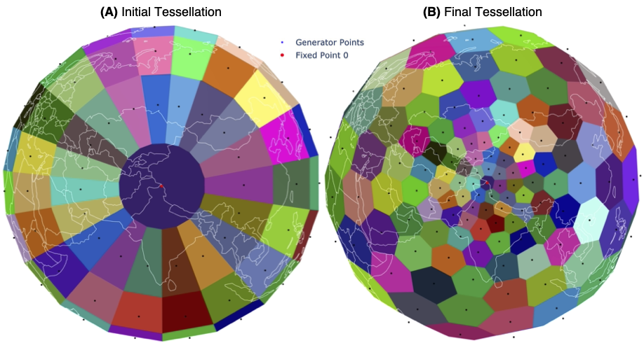
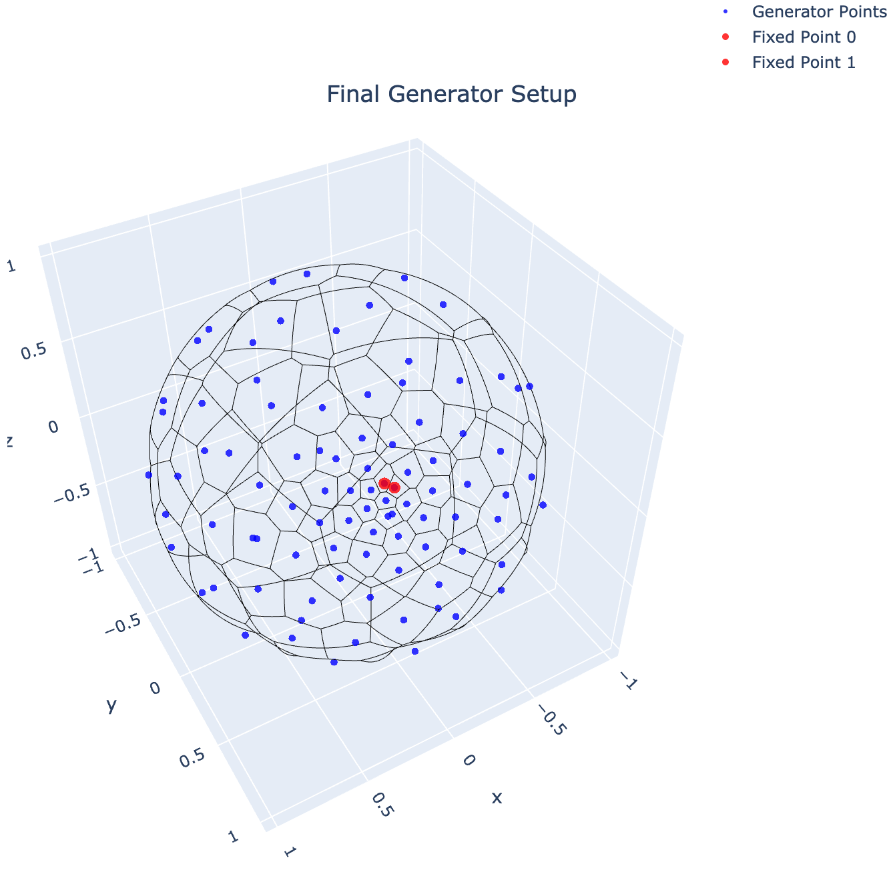
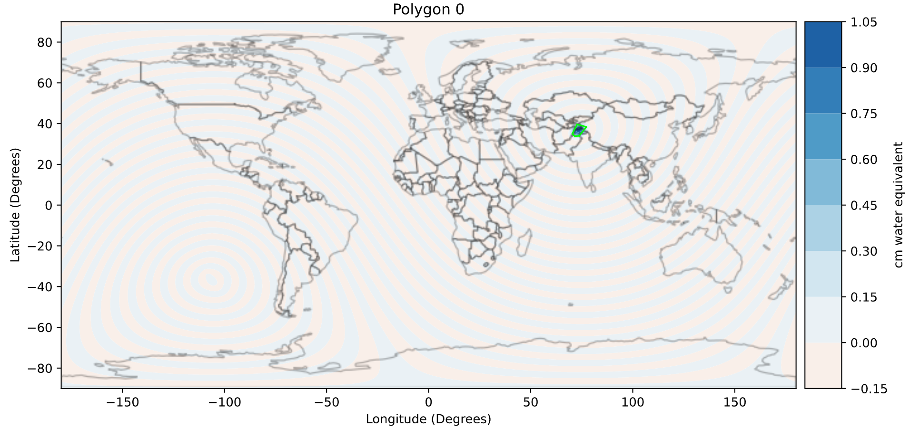
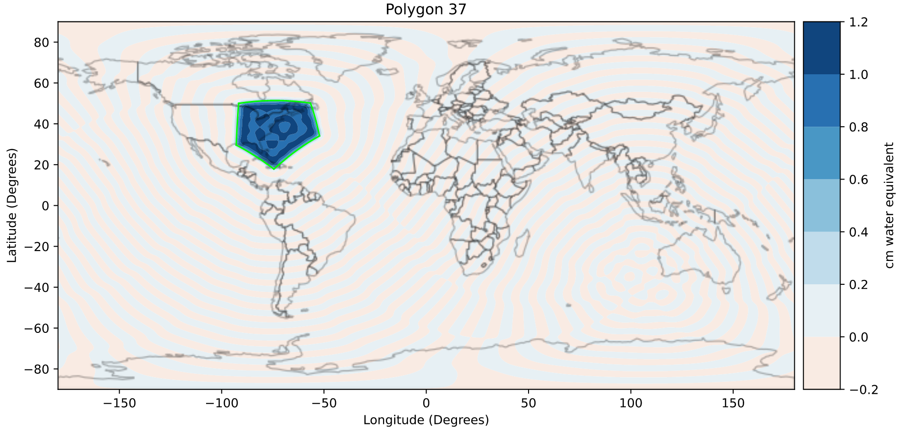
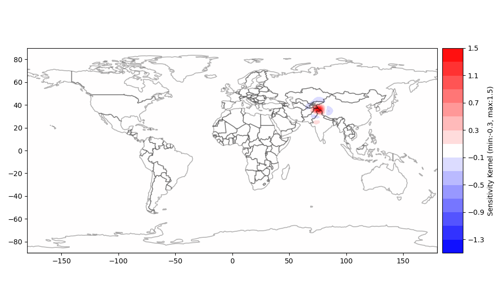
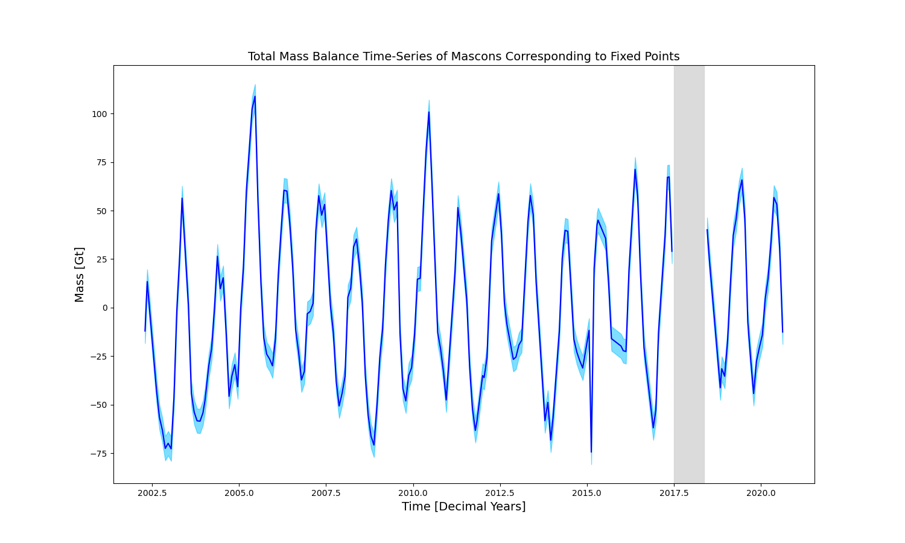

# Automated Dynamic Mascon Generation for GRACE and GRACE-FO Harmonic Processing

[](https://zenodo.org/badge/latestdoi/309498800)
[](https://github.com/yaramohajerani/FrontLearning/blob/master/LICENSE)
[](https://www.python.org/)


This repository and the [associated publication](https://www.mdpi.com/2072-4292/13/16/3134) presents a novel automated methodology for creating dynamic global mascons using iterative spherical Voronoi tessellations for the processing of [GRACE](https://grace.jpl.nasa.gov) (Gravity Recovery and Climate Experiment) and [GRACE-FO](https://gracefo.jpl.nasa.gov) (Follow-On) harmonics.

Click the image below for an interactive dynamic global configurations for the Karakoram region in High Mountain Asia:

<p><a href="karakoram_config.html">

</a></p>

The associated publication can be found at

> Mohajerani, Y.; Shean, D.; Arendt, A.; Sutterley, T.C. Automated Dynamic Mascon Generation for GRACE and GRACE-FO Harmonic Processing. Remote Sens. 2021, 13, 3134. [https://doi.org/10.3390/rs13163134](https://doi.org/10.3390/rs13163134)

### Abstract

> Commonly used mass-concentration (mascon) solutions estimated from Level-1B Gravity Recovery and Climate Experiment (GRACE) and GRACE Follow-On data, provided by processing centers such as the Jet Propulsion Laboratory (JPL) or the Goddard Space Flight Center (GSFC), do not give users control over the placement of mascons or inversion assumptions, such as regularization. While a few studies have focused on regional or global mascon optimization from spherical harmonics data, a global optimization based on the geometry of geophysical signal as a standardized product with user-defined points has not been addressed. Finding the optimal configuration with enough coverage to account for far-field leakage is not a trivial task and is often approached in an ad-hoc manner, if at all. Here, we present an automated approach to defining non-uniform, global mascon solutions that focus on a region of interest specified by the user, while maintaining few global degrees of freedom to minimize noise and leakage. We showcase our approach in High Mountain Asia (HMA) and Alaska, and compare the results with global uniform mascon solutions from range-rate data. We show that the custom mascon solutions can lead to improved regional trends due to a more careful sampling of geophysically distinct regions. In addition, the custom mascon solutions exhibit different seasonal variation compared to the regularized solutions. Our open-source pipeline will allow the community to quickly and efficiently develop optimized global mascon solutions for an arbitrary point or polygon anywhere on the surface of the Earth.


# Summary 

This respository showcases global dynamic mascon configurations that are regionally optimizied through a series of designed fixed-points and an iterative voronoi tessellation scheme based on polygon centroids on the surface of a unit sphere. 

While past work has focused on regionally optimizied mascon processing (e.g. [Mohajerani et al. 2018](https://doi.org/10.1029/2018GL078173), [Mohajerani et al. 2019](https://doi.org/10.1029/2019GL084665)), there is a need for a more robust approach to create *global* mascon configurations that are dynamic and depend on the geophysical feature of the region of interest to focus on. The global configuration resolves the issue of far-field leakage for sources of mass change that would otherwise not be accounted for by the mascons, as well as potential divergence of the sensitivity kernel at the boundaries of the mascon defintion.

This draws on previous work on regional 2-dimensional automated variable-size mascon design that I developed for Antarctica:


However, extending this to a global framework requires a 3D geodetic grid with no distortion. The present pipeline addresses this gap and allows for any user-defined set up local points to be transformed to a global mascon configuration for processing of GRACE and GRACE Follow-On harmonic data.

In the first notebook, `spherical_voronoi.ipynb`, I go through the steps of constructing a spherical voronoi tessellation with a set of fixed points. I choose two points on the Karakoram region in High Mountain Asia as our fixed points. 
[](https://nbviewer.jupyter.org/github/yaramohajerani/dynamic_mascons/blob/main/spherical_voronoi.ipynb)

In the second notebook, the resulting final configuration is used to construct a harmonic mascon representation, which is then used to calculate the sensitivity kernel of the mascons resulting from the inversion (refer to [Jacob et al. 2011](http://doi.org/10.1007/s00190-011-0522-7)). The resulting kernel for the fixed points is localized and has minimal leakage. This is in contrast to many configurations with regional coverage that are prone to divergence of the kernel at the boundaries of the domain, which illustrates the effectiveness of this method. While spherical caps have traditionally been used to create regional mascons (e.g. [Mohajerani et al. 2019](https://doi.org/10.1029/2019GL084665)) in order to minimze sharp edges and vertices that would rely on higher-degree harmonics, we find that directly using the voronoi polygons does not produce unacceptable leakage or noise, but instead allows us to create more flexible non-uniform global configurations. Finally, we fit the spherical harmonic data from GRACE and GRACE Follow-On satellites to these mascons to isolate the mass-balance sampled by the fixed points on the Karakorm.
[](https://nbviewer.jupyter.org/github/yaramohajerani/dynamic_mascons/blob/main/voronoi_to_mascon.ipynb)

# Pipeline Steps
The command-line pipeline for running this procedure for any user-defined point(s) is described below:

1. Get depedencies:
   * Install dependencies developed by [Tyler Sutterley](https://github.com/tsutterley) as part of the [read-GRACE-harmonics]() toolkit:
      ```
      python3 -m pip install --user git+https://github.com/tsutterley/read-GRACE-harmonics.git
      ```
      Also make sure the path containing executable scripts    are part of your system `PATH`. In my case, I had to add `~/.local/bin` to my `PATH`.

   * [Download](https://www.gplates.org/download.html) `pygplates`
    
     Again make sure the path containing this module is added to your `PYTHONPATH`. In my case, I had to add `~/pygplates_rev28_python37_MacOS64` to my `PYTHONPATH`. (See [the installation instructions](https://www.gplates.org/docs/pygplates/pygplates_getting_started.html#installation) for more details.)

2. Create the set of desired points in a `.csv` file, around which the global mascon configuration is created. E.g. the points used as the example in this repository for the Karakoram are:

    |LONS    | LATS    |
    |:------:|:-------:|
    |73.57999|36.29493 |
    |76.38069|34.81469 |
    * **It's important to keep the resolution of GRACE in mind when selecting these points. It won't be a problem if you just want to select a single coordinate and construct the mascons around it. But if specifying a few points that are strategically located on isolated geophysics signals, keep in mind that GRACE & GRACE-FO have a harmonic resolution of degree and order 60 or a spatial resolution of ~300km. It is possible to have smaller mascons, but you still have to add them together to respect the resolution of the satellites. The aim of this repository is not to downscale GRACE data, but to more strategically sample it with a user-defind non-uniform global mascon configuration for various regional analyses.**
3. Create the mascon configuration using the an iterative spherical voronoi tessellation scheme:
    ```
    python create_voronoi_regions.py parameters_voronoi_mascons.txt 
    ```
    Note the `epsilon` parameter in the parameter file is the increment (in radians) used in the initial grid of generators used to create voronoi regions. `iterations` is the number of iterations, and `ratio` is the scaling factor for shifting centroids towards the fixed points in every iteration (inversely proportional to distance).

    This script will save the final voronoi regions into file for later use, and also save an [interactive plot of the voronoi regions.](./imgs/spherical_voronoi_regions.html)
    

    *OPTIONAL:* You can also create a plot of the created mascons on a region of interest, along with RGI polygons as well as JPL or Goddard mascons if specified:
    ```
    python compare_mascons.py parameters_voronoi_mascons.txt
    ```
    Including `--JPL` or `--GSFC` inline arguments before the parameter files will also compare with JPL or Goddard mascon locations. But their paths have to be specified in the parameter file.

4. Convert the spherical voronoi regions to mascon harmonics:
    ```
    python calc_voronoi_harmonics.py parameters_voronoi_mascons.txt
    ```

    This script will save the harmonic and corresponding spatial representations of mascons created directly from the voronoi polygons. **As the mascons get further away from the region of interest, they become larger. We are not interested in sampling the mass change from these regions. However, having a global configuration allows us to minimize leakage and avoid any far-field signal intefere with our mass change retrieval. Furthermore, directly using the voronoi polygons as our mascons allows for a more flexible global configuration without gaps between the mascons, and the vertices of the polygons do not appear to result in significant noise or ringing of the harmonics as shown in step 5.**

    Mascon corresponding to the first fixed point:
    

    Sample far-field mascon with significantly larger size:
    
5. Create the corresponding sensitivity kernels

   **Note**: This uses executable scripts that were installed as part of `read-GRACE-harmonics`. Provided that you have added the corresponding link to your system `PATH` (see step 1), you should be able to directly call the script without a preceding "python" command.
   ```
   calc_sensitivity_kernel.py --reference CF parameters_voronoi_mascons.txt
   ```

   This will save the harmonic and spatial representation of the sensivivity kernel of each mascon in the output directory specified in the parameter file. For a better understanding of the sensivity kernel, refer to [Jacob et al. 2011](http://doi.org/10.1007/s00190-011-0522-7).
6. Sum up the sensitivity kernels for the fixed points and plot them:
   ```
   python combine_kernels.py parameters_voronoi_mascons.txt
   ```
   

   We see that the kernel is confined to the region determined by the fixed points, with minimal ringing from the vertices of the polygons. **It is noteworthy to emphasize that this global regionally-optimizied configuration is rather localized with minimal leakage, whereas regional spherical cap configurations are prone to diverging at the boundaries and do not capture far-field signals that are not covered by any mascons, which can leak into the area of interest.**
7. If the kernel from step 6 looks acceptable, we can fit the actual GRACE harmonics to the mascons:
   1. Download and pre-process GRACE harmonics:

      **Note** You need your [PO.DAAC Drive](https://podaac-tools.jpl.nasa.gov/drive/) credentials to download the GRACE data. Use your [NASA Earthdata](https://urs.earthdata.nasa.gov) credentials  to log in to PO.DAAC to get your username and password.
      ```
      sh grace_data.sh
      ```
      The bash script will ask for your password and output directory to download the data and create date and index files.
   2. Fit the harmonics to the mascons:
      ```
      calc_mascon.py --reference CF --directory ~/data.dir/grace.dir parameters_voronoi_mascons.txt
      ```
   3. Add time-series of the mascons corresponding to fixed points and output the total time-series and plot.
      ```
      python combine_mascons.py parameters_voronoi_mascons.txt
      ```
      This will save a time-series of the sum of the mass balance of all the mascons corresponding to the fixed points, with a corresponding mass balance time-series.
      


# Citation
The Github repo can be cited as
> Mohajerani, Y. Yaramohajerani/Dynamic_mascons: Release for Accepted Manuscript (v2.0). 2021. Available online: 
[https://doi.org/10.5281/zenodo.5167967](https://doi.org/10.5281/zenodo.5167967)

# License
The code presented in this repository is under the [MIT license](./LICENSE).
Copyright &copy; 2020 Yara Mohajerani
